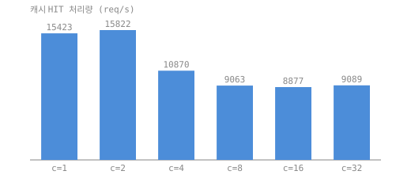

# 벤치마크

`make bench` 가 이 파일을 다시 만든다. 숫자는 환경에 따라 달라지므로
표의 절대값이 아니라 **같은 실행 안에서의 차이**를 보면 된다.

- 환경: macOS-26.5.2 / arm64 / Python 3.9.6
- 측정 시각: 2026-09-22 09:48:32 KST
- 원본: `scripts/bench.py` 안의 고정 응답 서버(본문 1 KiB, `public, max-age=600`)
- 프록시: worker 8, queue 32, `PROXY_TIMEOUT_MS=2000`

## 1. 프록시가 요청 하나에 더하는 비용

| 경로 | p50 | p90 | p99 | 평균 |
|---|---|---|---|---|
| 원본에 직접 (기준선) | 0.110 ms | 0.156 ms | 0.313 ms | 0.120 ms |
| 프록시 경유, 매번 MISS | 0.148 ms | 0.216 ms | 0.324 ms | 0.165 ms |
| 프록시 경유, 캐시 HIT | 0.055 ms | 0.078 ms | 0.162 ms | 0.063 ms |

- MISS 가 직접 요청보다 **+0.038 ms**(p50). 이게 연결 하나를 더 열고
  요청·응답 헤더를 한 번 더 파싱하는 값이다.
- HIT 는 MISS 대비 **0.148 ms → 0.055 ms (2.7배)**. 원본이 거의 즉시
  응답하는 조건에서 잰 값이므로, 이 배수는 **원본 지연이 0 일 때의 하한**이다.
  원본이 느릴수록 배수는 커진다.

## 2. 동시성에 따른 캐시 HIT 처리량

| 동시 클라이언트 | req/s |
|---|---|
| 1 | 15423.3 |
| 2 | 15822.8 |
| 4 | 10870.6 |
| 8 | 9063.8 |
| 16 | 8877.6 |
| 32 | 9089.8 |

최고 처리량은 동시 2 에서 15822.8 req/s, 동시 32 에서는 9089.8 req/s 로
떨어졌다.

**이 표를 프록시의 확장성 곡선으로 읽으면 안 된다.** 부하 생성기가 스레드
32 개짜리 Python 이라 동시성을 올리면 클라이언트 쪽 GIL 경합이 먼저 커진다.
최고점이 worker 수(8)보다 한참 낮은 2 에서 나온 것이 그 증거다. 여기서
가져갈 수 있는 결론은 두 가지뿐이다. (1) 캐시 HIT 경로의 처리량은 이
조건에서 만 단위 req/s 수준이고, (2) 그 값이 프록시 능력의 **하한**이다.
worker 풀이 실제로 병목이 되는 모습은 3번에서 원본 지연이 클라이언트
비용을 압도할 때 비로소 관측된다.

## 3. 느린 원본에서의 head-of-line blocking

README 가 "느린 원본이 worker 를 오래 붙잡으면 처리량이 떨어진다"고
적고 있으니, 그게 실제로 관측되는지 재봤다.

| 항목 | 값 |
|---|---|
| 동시 요청 수 | 32 |
| 원본 응답 지연 | 200.0 |
| worker 수 | 8 |
| 풀이 병목이라면 예상되는 배치 수 | 4 |
| 그 경우 예상 총 시간 | 0.8 |
| 실제 총 시간 | 0.82 |
| 가장 늦은 요청 1건 | 0.815 |

동시 32 요청이 200 ms 짜리 원본을 때릴 때 총 0.820 초가 걸렸다.
worker 가 8 개이므로 요청은 4 배치로 나뉘어 처리되고, 풀이 병목이라면
0.800 초가 나와야 한다. 실측이 여기에 붙는다는 것은 병목이 대역폭이나
CPU 가 아니라 **worker 수 그 자체**라는 뜻이다. 가장 늦은 요청은 0.815 초를
기다렸다 — 상한을 두는 대가가 이것이다.

## 다음 병목

1. 느린 원본에 대한 head-of-line blocking(위 3번). 요청마다 worker 하나를
   붙잡는 구조라 worker 를 늘리는 것 외에는 답이 없다. 근본 해결은 비동기
   I/O 이고, 그건 이 저장소의 범위를 넘는다.
2. 같은 cold URL 에 대한 동시 요청이 병합되지 않아 원본에 worker 수만큼
   중복 요청이 간다(`tests/test_proxy.py` 의
   `test_concurrent_misses_stay_bounded_and_agree` 가 이 동작을 고정한다).
3. 캐시 전역 mutex 하나. 항목이 16 개뿐이라 선형 탐색이 싸서 지금은 문제가
   아니지만, 위 두 가지를 고치고 나면 다음 차례가 여기다.
